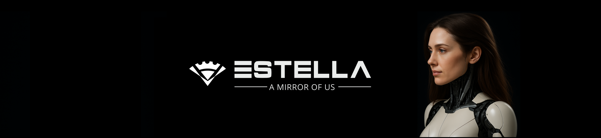

<!-- Banner image -->

www.estellahumanoids.com

# Estella Humanoid Robot 🤖
**An open-source, human-inspired humanoid robot - a mirror of us.**

---

## About
Estella is an **open-source humanoid robot** designed for research, education, and innovation. Its modular design focuses on **human-inspired anatomy** and expressive interaction. Current modules include:

- **Face**
- **Spine**  
- **Shoulders**

The project started in 2017 under **Prof. Behnam Rahnama** at Medis Startup Studio. It was developed through the joint efforts of Prof. Rahnama, **Negin (Fatemeh) Heiran**, and supporting colleagues. Today, Estella continues as an **independent open-source project**, guided by Negin and a global community of contributors.

Estella is more than a robot, it’s a platform for learning, experimentation, and collaboration.

---

## Features
- **Modular and extensible design**: each component can be replaced or upgraded independently.  
- **Human-inspired mechanics**: realistic spine, expressive face, and articulated shoulders.  
- **Open-source 3D models**: CAD files, STEP, STL, and renders for easy access.  
- **Community-driven development**: everyone can contribute, learn, and iterate.

---

## Quick Start
1. Browse 3D models: `designs`
2. Check documentation and guides: `docs`
3. Build a module or modify designs: download from `V01` folder for first version.

**File formats:** STEP and STL for compatibility; editable CAD files included where possible.

**Recommended software:** FreeCAD (open-source tools), Solidworks

---

## Contributing
We welcome **researchers, engineers, designers, and makers**.  

**How to contribute:**
1. Fork the repository.  
2. Create a branch and make your changes.  
3. Submit a Pull Request with description and screenshots/renders.  

Not familiar with Git? Share your ideas or designs via **GitHub Discussions** or community channels or simply email me directly through hello@estellahumanoids.com

**Versioning:**  
- `Vxx/` → the last version is the most updated.

See `CONTRIBUTING.md` for details.

---

## License
- **Hardware & 3D designs:** CC BY-SA 4.0 (https://creativecommons.org/licenses/by-sa/4.0/) and GPL v3 (https://www.gnu.org/licenses/gpl-3.0.en.html)
- **Software & scripts:** GPL v3 (https://www.gnu.org/licenses/gpl-3.0.en.html)
- **Documentation & media:** CC BY 4.0 (https://creativecommons.org/licenses/by/4.0/)

Full license texts are included in the repository (`LICENSE-HARDWARE`, `LICENSE-SOFTWARE`, `LICENSE-DOCS`).

---

## Community & Support
- Join discussions: [GitHub Discussions](#)  
- Real-time chat: Discord / Matrix (links coming soon)  
- Updates & news: follow project on www.estellahumanoids.com and Linkedin page https://www.linkedin.com/company/estella-humanoids

---

## Credits
Estella was conceived by Prof. Behnam Rahnama and co-developed by Negin (Fatemeh) Heiran at Medis Startup Studio. Today, Estella continues as an independent open-source project, led by Negin and open to the global community to **explore, innovate, and contribute**.

---

**Join us — Estella is modular, human-inspired, and a true mirror of us.**
